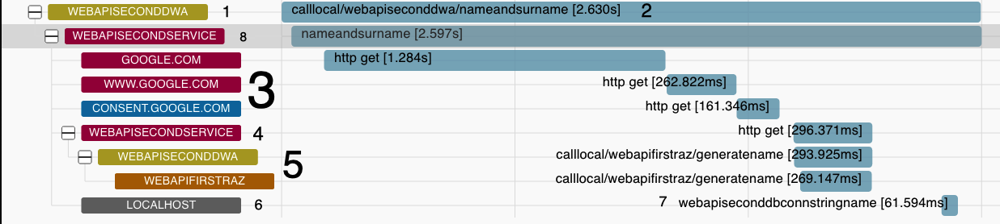

# Tracing



1. In case of first "tag" it Dapr application name. This "tags" are can be overriden by setting a tag: `activity.SetTag("net.peer.name", "WebApiSecondDwa")`
2. Can be changed by `activity.DisplayName = "name"`, I don't know how to change it for Dapr managed tracing though
3. Set by `HttpClientInstrumentation`, if "net.peer.name" is not set it's populated with target id
4. Set as a part of `HttpClientInstrumentation`: `.AddService("webapisecondservice")`
5. Dapr generated instrumentation
6. SQLClient instrumentation
7. DB name taken from the connection string of a DB
8. `AspNetCoreIntrumentation` - it seems to pick up service name from `HttpClientInstrumentation` (point 4.)

If an app uses only EF Core for db access it's enough to use only `EntityFrameworkCoreInstrumentation` - there's no need to use `SqlClientInstrumentation`

### Enriching instrumentation example:

```csharp
 .AddSqlClientInstrumentation(options =>
        {
            options.EnableConnectionLevelAttributes = true;
            options.RecordException = true;
            options.SetDbStatementForText = true;
            options.SetDbStatementForStoredProcedure = true;
            options.Enrich = (activity, eventName, rawObject) =>
            {
                if (!eventName.Equals("OnCustom"))
                {
                    return;
                }

                 activity.SetTag($"httpclient.webapisecond.customtag.eventname", eventName);
                 activity.SetTag($"httpclient.webapisecond.customtag.rawObjectType",
                                 rawObject.GetType().ToString());
            };
        })
```
